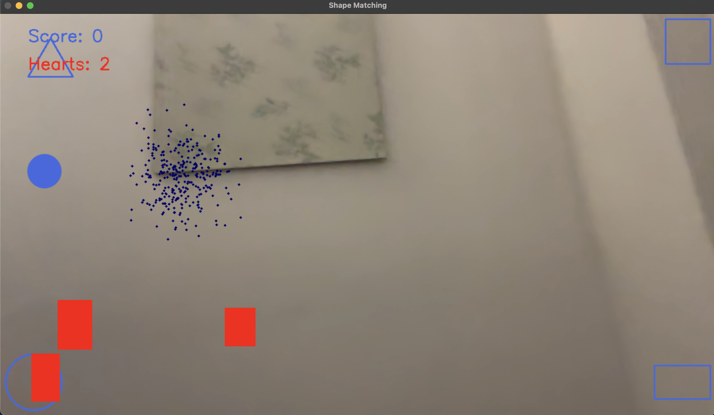

# Hand Tracking with Particle Filter

## Introduction
This project demonstrates hand tracking using particle filter with the help of gamification.

## How does it work

User has to move the filled shape to the corresponding shape outline by moving the palm of their hand in front of the camera.

For a successful attempt, user gets a positive score. 

For an unsuccessful attempt (such as colliding with obstacles or filling in wrong shape), user loses a health point.

If you run out of health points (hearts), you lose the game.

## Libraries used

- OpenCV (for graphics)
- Mediapipe (for hand tracking)
- PyGame (for gamification)

## Credits

- Halidu Abdulai
- Ahmad Kamal Baig

## Demo 

